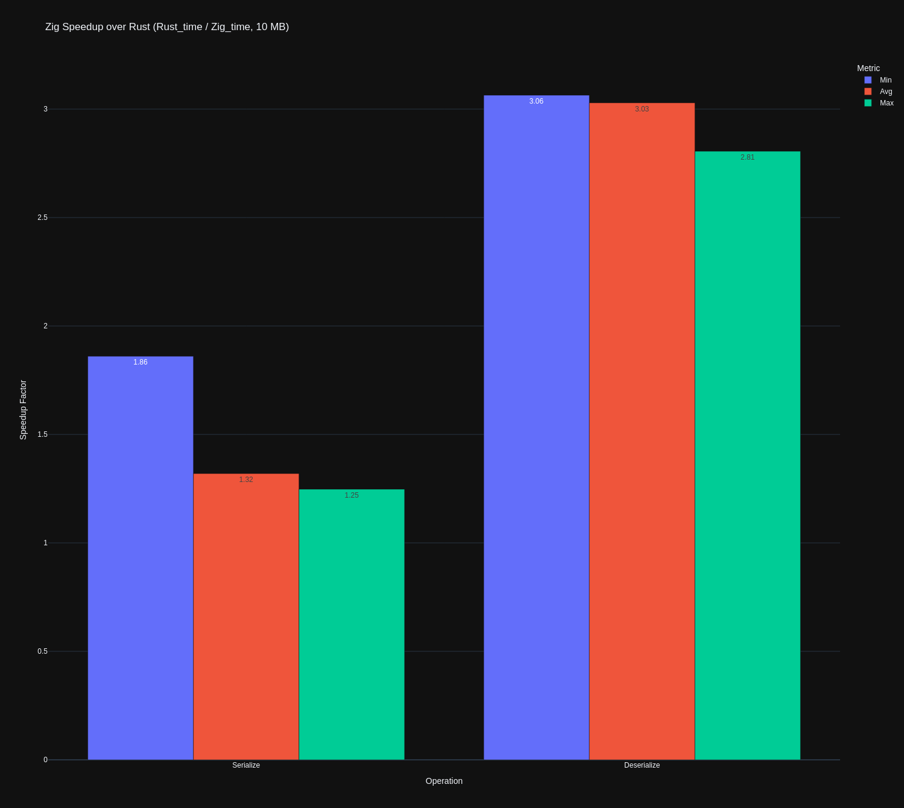

# Safetensors implementation for [Zigrad](https://github.com/Marco-Christiani/zigrad)

## Benchmarks

```
Rust (official impl)
Serialize 10_MB       time:   [410.56 µs 411.54 µs 412.55 µs]
Deserialize 10_MB      time:   [2.5461 µs 2.5503 µs 2.5558 µs]

Zig (ours)
Serialization: 10_MB [min=220.658, avg=311.882, max=330.668]
Deserialization: 10_MB [min=0.831, avg=0.842, max=0.911]
```



System info

```
Kernel: 6.8.0-48-generic
CPU: AMD Ryzen Threadripper PRO 5975WX
CPU Arch: x86_64
Zig: 0.14.1
Cargo: cargo 1.87.0
Safetensors: b9ccdc69c0ba1f3fad785960981600a6a7553969
```
